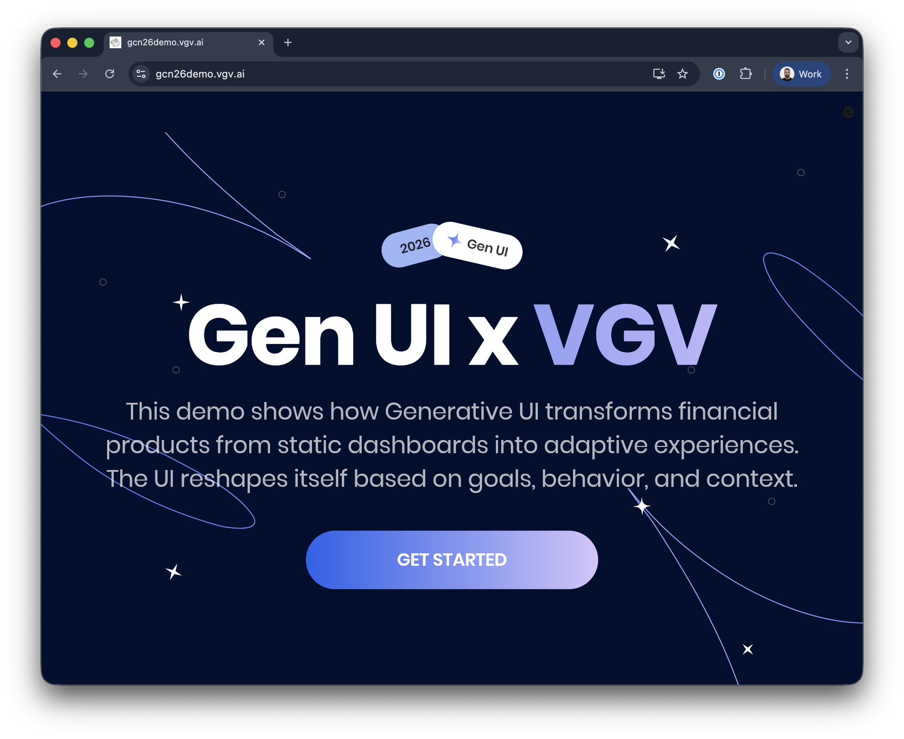
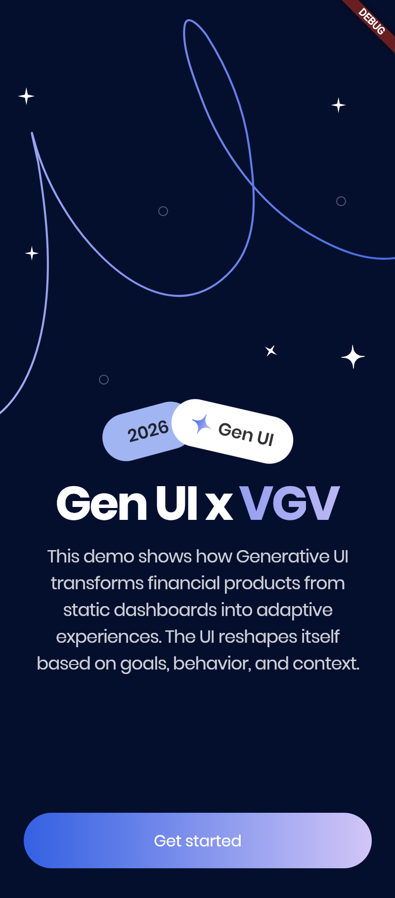
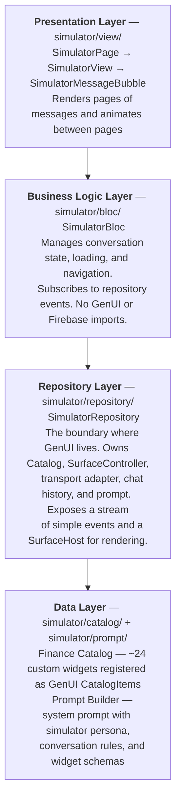

# Very Good Life Goal Simulator

![coverage][coverage_badge]
[![style: very good analysis][very_good_analysis_badge]][very_good_analysis_link]
[![License: MIT][license_badge]][license_link]

A multi-platform Flutter demo app built for **Google Cloud Next 2026**, showcasing [Firebase AI](https://firebase.google.com/docs/vertex-ai-in-firebase) and [GenUI](https://github.com/flutter/genui) (Generative UI) in a personal-finance dashboard. Runs on Android, iOS, Web, and macOS from a single codebase.

**[Live Demo](https://gcn26demo.vgv.ai)**

<p align="center">
  <a href="https://gcn26demo.vgv.ai"></a>
  &nbsp;&nbsp;&nbsp;&nbsp;
  <a href="https://gcn26demo.vgv.ai"></a>
</p>


## Features

- **AI Financial Simulator** — chat-powered insights using Firebase AI and structured output via [Dartantic](https://github.com/brianegan/dartantic)
- **Generative UI** — AI responses rendered as interactive Flutter widgets (charts, tables, chips) via [GenUI](https://github.com/flutter/genui)
- **Dashboard** — sparkline cards, portfolio overview, and responsive layouts
- **Rive Animations** — loading screens and thinking indicators
- **Multi-platform** — runs on Android, iOS, Web, and macOS

## Getting Started

### Prerequisites

- [FVM](https://fvm.app/) (Flutter Version Management)
- [FlutterFire CLI](https://firebase.flutter.dev/docs/cli) for Firebase configuration

### Install Flutter SDK

```sh
fvm install
```

### Firebase Setup

This project requires a Firebase project with **Firebase AI** and **App Check** enabled. The only config file needed is `lib/firebase_options.dart` (Dart-only initialization — no native config files required). Generate it with:

```sh
flutterfire configure --platforms=android,ios,macos,web --out=lib/firebase_options.dart
```

### Run the App

```sh
# Development
fvm flutter run --target lib/main_development.dart

# Production
fvm flutter run --flavor production --target lib/main_production.dart
```

To enable App Check with reCAPTCHA (web builds):

```sh
fvm flutter run --target lib/main_development.dart --dart-define=RECAPTCHA_SITE_KEY=your_key_here
```

_Works on iOS, Android, Web, and macOS._

## Architecture

The app follows VGV's [layered architecture](https://engineering.verygood.ventures/development/architecture/architecture/) with a **feature-first** structure and [BLoC](https://bloclibrary.dev/) for state management:

```
lib/
  app.dart         — Root MaterialApp widget
  app_check/       — Firebase App Check debug token helpers
  bootstrap.dart   — App initialization (Firebase, providers, error handling)
  design_system/   — Theme, colors, spacing, and reusable UI widgets
  dev_menu/        — Component catalog pages (development tool)
  error_reporting/ — Error reporting repository
  feature_flags/   — Feature flag repository, cubit, and dev menu drawer
  l10n/            — Localization (English, Spanish)
  onboarding/      — Intro, profile selection, and focus selection screens
  simulator/       — AI Life Goal Simulator (the GenUI feature — see below)
```

Key dependencies:
- **firebase_ai** — Gemini model access via Firebase
- **firebase_app_check** — Protects Firebase backends from abuse
- **genui** — Renders structured AI output as Flutter widgets
- **flutter_bloc** — State management
- **dartantic_ai / dartantic_firebase_ai** — Structured output schemas for AI

### Simulator: GenUI behind a layered architecture

The `simulator/` directory is the heart of the app. It demonstrates how to integrate [GenUI](https://github.com/flutter/genui) — where an LLM generates entire Flutter UIs as structured JSON — while keeping the complexity hidden behind clean architectural boundaries.

The key insight: **the `SimulatorRepository` encapsulates all GenUI plumbing** (catalog, surface controller, transport adapter, prompt builder, and chat model) behind a two-method API: `startConversation()` and `sendMessage()`. The bloc and UI layers never touch GenUI directly.



#### How it works

1. **User completes onboarding** — profile type and focus areas flow into `SimulatorBloc` via `SimulatorStarted`.
2. **Bloc calls the repository** — `startConversation()` wires up GenUI internals; `sendMessage()` sends the initial prompt.
3. **Repository streams to the LLM** — the system prompt (persona + widget schemas) and chat history go to `FirebaseAIChatModel`. Responses stream back as chunks.
4. **GenUI parses the response** — `A2uiTransportAdapter` extracts JSON describing surfaces and components. `SurfaceController` instantiates widgets from the catalog.
5. **Repository emits events** — simple types like `SimulatorConversationSurfaceAdded` and `SimulatorConversationTextReceived` bubble up to the bloc.
6. **Bloc updates state** — each new surface becomes a page. The view animates to it and renders it via `SurfaceHost`.
7. **User interacts with a surface** — input widgets (sliders, radio cards, filter chips) write values to GenUI's reactive `DataContext`. When the user taps an action button, the interaction data is sent back to the LLM as the next message, and the cycle repeats.

#### Navigating the code

| Directory | What to look at | Why |
|---|---|---|
| `simulator/repository/` | `SimulatorRepository` | Start here. This is the integration boundary — see how GenUI's catalog, controller, adapter, and chat model are composed and hidden behind a stream of simple events. |
| `simulator/bloc/` | `SimulatorBloc`, `SimulatorState` | See how repository events map to a paginated conversation state (`List<List<DisplayMessage>>`). Note: no GenUI imports. |
| `simulator/view/` | `SimulatorPage`, `SimulatorView`, `SimulatorMessageBubble` | See how surfaces are rendered and how page transitions are animated. The view only knows about `SurfaceHost` — it never constructs GenUI objects. |
| `simulator/catalog/items/` | Any catalog item (e.g., `gcn_slider_catalog_item.dart`) | See how a single widget is defined as a `CatalogItem` with a JSON schema and a `widgetBuilder`. This is how you add new components the LLM can use. |
| `simulator/prompt/` | `PromptBuilder` | See the system prompt that defines the simulator persona, conversation rules, and widget usage guidelines. This is where you shape the LLM's behavior. |

## Running Tests

```sh
fvm dart run very_good_cli:very_good test --coverage --test-randomize-ordering-seed random
```

To view the coverage report:

```sh
genhtml coverage/lcov.info -o coverage/
open coverage/index.html
```

## Bloc Lints

This project uses [bloc_lint](https://pub.dev/packages/bloc_lint) to enforce best practices.

```sh
fvm dart run bloc_tools:bloc lint .
```

You can also validate with VSCode using the [official bloc extension](https://marketplace.visualstudio.com/items?itemName=FelixAngelov.bloc).

## Translations

This project uses [flutter_localizations][flutter_localizations_link] and follows the [official internationalization guide][internationalization_link].

Add strings to `lib/l10n/arb/app_en.arb`, then regenerate:

```sh
fvm flutter gen-l10n --arb-dir="lib/l10n/arb"
```

Or just run the app — code generation happens automatically.

[coverage_badge]: coverage_badge.svg
[flutter_localizations_link]: https://api.flutter.dev/flutter/flutter_localizations/flutter_localizations-library.html
[internationalization_link]: https://flutter.dev/docs/development/accessibility-and-localization/internationalization
[license_badge]: https://img.shields.io/badge/license-MIT-blue.svg
[license_link]: https://opensource.org/licenses/MIT
[very_good_analysis_badge]: https://img.shields.io/badge/style-very_good_analysis-B22C89.svg
[very_good_analysis_link]: https://pub.dev/packages/very_good_analysis
